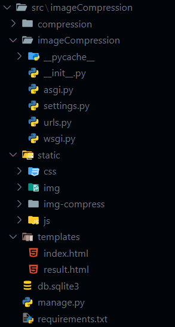
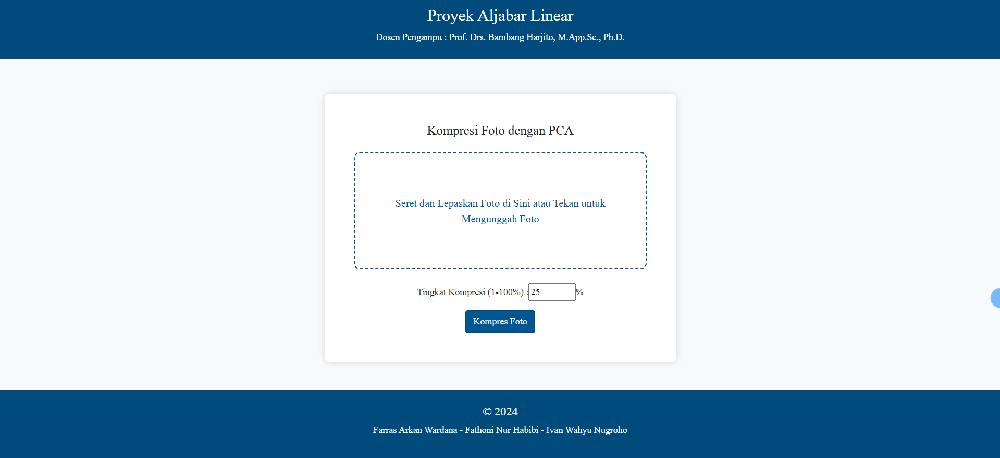
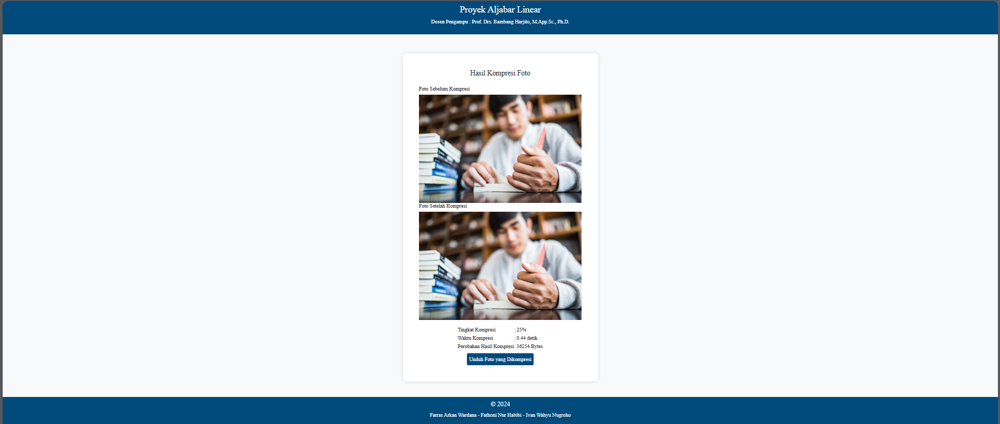

# WEBSITE KOMPRESI CITRA DENGAN ALGORITMA PCA

## Latar Belakang

Aplikasi Aljabar Linear ini adalah proyek website yang dikembangkan sebagai proyek tugas Ujian Akhir Semester mata kuliah Aljabar Linear yang diampu oleh [Prof. Drs. Bambang Harjito, M.App.Sc., Ph.D.](https://bambang.staff.uns.ac.id/). Proyek ini dikembangkan oleh :

1. Farras Arkan Wardana (L0123052)
2. Fathoni Nur Habibi (L01233054)
3. Ivan Wahyu Nugroho (L013068)

## Deskripsi Program

Program ini adalah website sederhana untuk kompresi citra dengan algoritma _Principal Component Analysis_ (PCA). Program ini dikembangkan dengan menggunakan [Django](https://www.djangoproject.com/) dan [Bootstrap](https://getbootstrap.com/) CSS. Dalam program ini, _user_ dapat memberikan amsukan gambar dan menyetting tingkat kompresi sesuai yang dinginkan.

### Fitur dan Keunggulan Program

Program ini dikembangkan dengan menggunakan [Django](https://www.djangoproject.com/) sehingga program bersifat modular. Selain itu, juga digunakan [Bootstrap](https://getbootstrap.com/) CSS untuk melakukan _styling_ _website_ ini. Pengguna dapat mengunggah foto dengan menekan _drop zone_ atau dapat melakukan _drag and drop_ di _drop zone_. Pengguna dapat mengatur tingkat kompresi sesuai keinginan (1 s/d 100%). Dengan menekan tombol `Kompres Foto`, proses kompresi dengan algoritma PCA akan berjalan. Setelah proses kompresi selesai, dapat dilihat foto sebelum dan setelah kompresi. Pengguna dapat melihat berapa tingkat kompresi yang diberikan, waktu yang dibutuhkan untuk melakukan kompresi, dan selisih ukuran foto sebelum dan setelah dikompres. Selain itu, pengguna juga dapat mengunduh foto setelah dilakukan kompresi.

## Struktur Folder

Terdapat tiga folder dalam proyek ini, yaitu [docs](./docs/), [src](./src/), dan [test](./test/). Folder [docs](./docs/) berisi laporan dokumentasi proyek ini. Sementara folder [src](./src/) berisi _source code_ utama dari program ini dan folder [test](./test/) berisi folder [before](./test/before/) yang menyimpan foto sebelum dikompres dan folder [after](./test/after/) yang menyimpan foto setelah dikompres.

Dalam proyek utama Django, folder utamanya adalah [imageCompression](./src/imageCompression/). Struktur foldernya adalah sebagai berikut : 



## Instalasi

Program ini telah dilengkapi dengan file [requirements.txt](./requirements.txt). Untuk memasang seluruh _library_ yang diperlukan dalam proyek ini dapat dengan menggunakan perintah

```pip
pip install -r requirements.txt
```

Untuk menjalankan proyek Django, dapat menggunakan perintah berikut : 

```python
python manage.py runserver
``` 

Pastikan direktori kerja sudah berada di [src/imageCompression](./src/imageCompression/).

## Tampilan

Tampilan awal website adalah sebagai berikut :


Tampilan website pasca kompresi adalah sebagai berikut : 


## Proyek Ini Dikembangkan Oleh

1. [Farras Arkan Wardana (L0123052)](https://www.instagram.com/arknwrdn/)
2. [Fathoni Nur Habibi (L01233054)](https://www.instagram.com/fn._habibi/)
3. [Ivan Wahyu Nugroho (L013068)](https://instagram.com/ifwhy._)